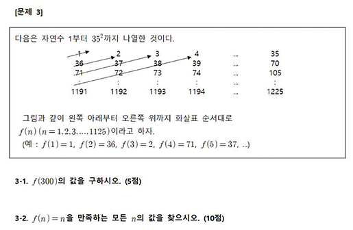

# 수리논술문제 실험하기

다음은 2019학년도 수능 직후 시행된 어느 대학교의 수시모집 논술시험에 출제된 문제 중 하나이다.

이 문제에 대해서 수학적인 풀이와 증명을 작성하는 것이 본래의 의도이겠지만,

모든 경우를 일일이 세아리는 프로그램을 만들어 답을 구해보자.

크기가 한정되어있는 수열에 대한 카운팅이므로, 일일이 세리는 것도 꽤 합리적인 해법일 수 있다.

